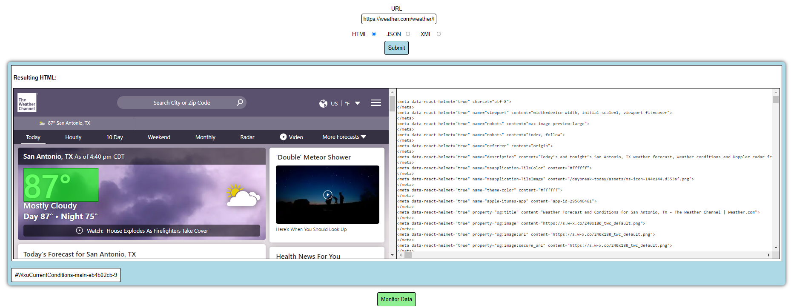

# Web Data Monitor



The Web Data Monitor is a tool that allows users to identify certain HTML, JSON, or XML sources and a specific item within that source that they would like to monitor for changes. The tool will then periodically check the source for changes and notify the user if the item has changed. The tool is designed to be used by users who are not familiar with programming or scripting languages but would like to monitor specific data sources for changes.

## Installation

The front-end of the Web Data Monitor is a simple html page that can be opened in any web browser. The back-end is a Python script that can be run on any machine with Python installed. To install the Web Data Monitor, follow these steps:

1. Clone the repository to your local machine.
2. Open the `index.html` file in a web browser.
3. Ensure that Python is installed on your machine and run the following command in the terminal to install the required Python packages:

```bash
pip install requests
pip install beautifulsoup4
pip install flask
pip install flask-cors
```

4. Run the Python script `app.py` in the terminal using the following command:

```bash
python app.py
```

5. The Web Data Monitor is now running and can be accessed through the web browser.

6. Launch the monitoring service by running the Python script `monitor.py` in the terminal using the following command:

```bash
python monitor.py
```

Now everything should be set up and the Web Data Monitor is ready to use. You can add new sources to monitor by entering the URL of the source and the item you would like to monitor in the input fields on the web page. The monitor will periodically check the sources for changes and notify you if the item has changed.

NOTE: The `monitor.py` script will need to be altered to include email functionality. For simplicity, the script currently prints the notification to the console. To get the full functionality, you will need to implement the `send_email` function in the script.

## Usage

The Web Data Monitor is designed to be simple and easy to use. To monitor a new source, follow these steps:

1. Open the Web Data Monitor in a web browser.
2. Enter the email address where you would like to receive notifications.
3. Enter the URL of the source you would like to monitor.
4. Select the type of source (HTML, JSON, or XML).
5. Click the "Submit" button and wait for the backend to retrieve a current version of the source.
6. Use the configuration menu to either add a CSS selector (for HTML) or navigate to the item you would like to monitor (for JSON or XML).
7. Click the "Monitor Data" button to add the resource to the monitoring list.